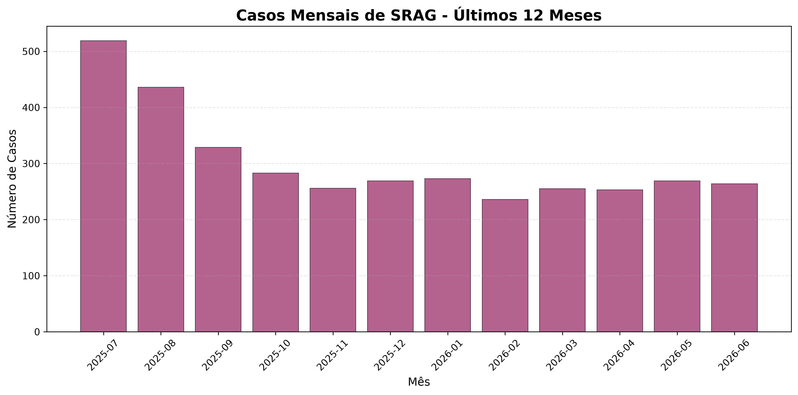

# SRAG Health Monitor

*[Versão em português](README.md)*

[](https://github.com/lucianoon/srag-health-monitor/actions/workflows/ci.yml)
[](https://www.python.org/)
[](https://fastapi.tiangolo.com/)
[](LICENSE)

A system that generates epidemiological reports on SRAG from DATASUS/SIVEP-Gripe
data, with an HTTP API, asynchronous execution by a worker, audit logging,
guardrails and chart generation.

**[View example report](docs/exemplo/relatorio_exemplo.md)** ·
**[View generated chart](docs/exemplo/casos_mensais.png)**

> **SRAG** (*Síndrome Respiratória Aguda Grave*) is Brazil's mandatory
> notification category for severe acute respiratory infection — the WHO SARI
> equivalent, not the 2003 SARS coronavirus. **SIVEP-Gripe** is the national
> surveillance information system that collects it, published as open data by
> **DATASUS**, the Brazilian Ministry of Health's IT department.

## Quick evidence

| Evidence | What it demonstrates |
|---|---|
| Offline test suite in CI | Pipeline, API, worker, lease/recovery, retry, guardrails and ingestion |
| DATASUS/SIVEP-Gripe data | Applied to a real Brazilian public-health domain |
| Per-stage resumable jobs | Resilience without redoing completed work |
| Versioned report and chart | Output you can verify before installing anything |
| Audit trail, PII anonymization and validations | Explicit security and governance |
| API + worker on Docker Compose | Operational separation of the services |

## Overview

The project grew from a PoC into an operable product base:

- FastAPI service to create and query report jobs.
- Separate worker to execute pending jobs, with a lease + heartbeat that
  recovers orphaned jobs when a worker dies.
- Multi-agent pipeline: SUS ingestion, epidemiological analysis and report writing.
- Job persistence in SQLite.
- SRAG database in SQLite.
- Markdown reports and charts in `outputs/reports`.
- Structured audit logs in `outputs/logs`.
- Docker Compose with `api` and `worker` services.
- CI with tests, a Docker build and a healthcheck smoke test.

## Sample output

Every pipeline run produces a Markdown report with epidemiological metrics,
contextual analysis, a risk level and charts generated from the database:



See the [full sample report](docs/exemplo/relatorio_exemplo.md) (generated with
synthetic data and the deterministic narrative — the same pipeline runs against
real DATASUS data and, optionally, an LLM-written narrative). The report itself
is in Portuguese, since that is the language of the published surveillance data.

## Architecture

```text
Client / API consumer
        |
        v
FastAPI (/reports, /reports/{job_id}, /reports/{job_id}/retry,
         /reports/{job_id}/artifact, /metrics)
        |
        v
SQLite jobs store (data/jobs.db)
        |
        v
Worker
        |
        v
GenerateReportService / Multi-Agent Orchestrator
        |
        v
Step blackboard (per-run state in data/pipeline_state/)
        |
        +--> collect_data  ─┐ (parallel)  SUSDataIngestionAgent -> data/srag.db
        +--> collect_news  ─┘             SUSDataIngestionAgent -> RSS feeds
        +--> analyze                      EpidemiologyAnalysisAgent -> findings and risk
        +--> generate_charts              ReportWriterAgent -> charts
        +--> write_report                 ReportWriterAgent -> Markdown
        +--> AuditLogger -> outputs/logs
```

The steps never call each other: each one declares preconditions over the
shared state and runs once they are satisfied (blackboard coordination).
Progress is persisted per step — re-running with the same `execution_id`
resumes from the point of failure without redoing completed work.

## Layout

```text
src/
  api/                 # FastAPI app
  services/            # use cases, job store and worker
  agents/              # multi-agent orchestrator and specialized agents
  tools/               # database, news and charts
  database/            # SRAG SQLite manager
  guardrails/          # validation, LGPD compliance and auditing
  utils/               # DATASUS processing
main.py                # synchronous CLI
worker.py              # worker process
Dockerfile
docker-compose.yml
Makefile
```

## Requirements

- Python 3.11+
- Docker/Compose, optional, for containerized execution
- `data/srag.db` to generate real reports

`OPENAI_API_KEY` is optional. With the key configured, the narrative sections of
the report (contextual analysis and conclusions/recommendations) are written by
the LLM (`SRAG_MODEL`, default `gpt-4.1-mini`) from findings that were computed
deterministically; without the key — or if the call fails — the report falls
back to the rule-based deterministic mode. Which mode was used is recorded in
the "Fonte e Rastreabilidade" (source and traceability) section of every report.

Metrics, findings and risk level are **always** computed by deterministic code.
The LLM only writes prose, under instructions never to invent numbers, and with
no access to patient data. The generated text goes through the same content
validation and PII anonymization guardrails.

## Running

### Installation

```bash
make install
```

`make install` runs `uv sync --locked`: versions come from `uv.lock`, so the
local environment, CI and the Docker image resolve exactly the same
dependencies. Install [uv](https://docs.astral.sh/uv/) if you do not have it.

Optionally copy the environment file:

```bash
cp .env.example .env
```

### Without Docker

Terminal 1:

```bash
make api
```

Terminal 2:

```bash
make worker
```

Healthcheck:

```bash
make smoke
```

Create a job:

```bash
curl -X POST http://localhost:8000/reports \
  -H "Content-Type: application/json" \
  -d '{}'
```

Query its status:

```bash
curl http://localhost:8000/reports/<job_id>
```

Ingest official SUS/OpenDATASUS data before generating real reports:

```bash
SRAG_SUS_DATA_URL="https://..." make ingest
```

For a smoke test on a sample:

```bash
.venv/bin/python ingest.py --source-url "https://..." --nrows 1000
```

When `SRAG_API_KEY` is configured, send the header:

```bash
curl http://localhost:8000/reports \
  -H "X-API-Key: $SRAG_API_KEY"
```

### With Docker

```bash
make docker-up
```

Stop:

```bash
make docker-down
```

The image runs as an unprivileged user (`app`, uid/gid `10001`). On Linux,
the host directories mounted into the containers (`./data` and `./outputs`)
must be writable by that uid:

```bash
mkdir -p data outputs/reports outputs/logs
sudo chown -R 10001:10001 data outputs
```

For a different uid, rebuild with `docker compose build --build-arg
APP_UID=$(id -u) --build-arg APP_GID=$(id -g)`. On Docker Desktop
(macOS/Windows) this is usually unnecessary.

### Validation

```bash
make compile
make test
make docker-config
```

## API

`GET /health` and `GET /ready` are public, for healthchecks. Every other
endpoint requires `X-API-Key` when `SRAG_API_KEY` is configured.

### `GET /health`

Returns the basic API status.

```json
{"status": "ok"}
```

### `GET /ready`

Returns operational readiness, including access to the jobs database, writable
directories and the presence of `data/srag.db`.

### `GET /reports`

Lists recent jobs.

Query params:

- `limit`: 1 to 100, default `20`
- `status`: `queued`, `running`, `succeeded` or `failed`

### `POST /reports`

Creates an asynchronous job.

Optional payload:

```json
{
  "model": "gpt-4.1-mini",
  "db_path": "srag.db",
  "output_dir": "team-a"
}
```

Paths are never server paths: `db_path` is relative to `SRAG_DATA_DIR` and
`output_dir` is a subdirectory of `SRAG_OUTPUT_DIR`. Absolute paths (POSIX,
Windows or UNC), `..` segments and null bytes are rejected with `422`; a
symlink inside the base that points outside it is rejected with `400`. The
worker applies the same validation when running the job (including older jobs
and retries), marking it as `failed`. The same applies to `POST /reports/sync`.

Response:

```json
{
  "job_id": "uuid",
  "status": "queued",
  "status_url": "/reports/uuid"
}
```

### `GET /reports/{job_id}`

Queries the job's status and result.

Possible states:

- `queued`
- `running`
- `succeeded`
- `failed`

#### Lease and recovery of orphaned jobs

When a worker claims a job it gets a *lease* (`lease_owner` +
`lease_expires_at`, 60 s by default), and a heartbeat thread renews it every
third of the lease while the job runs. If the worker dies, the heartbeat stops
and the lease expires; the next `claim_next` (from any worker) claims the job
again, in the same `BEGIN IMMEDIATE` transaction that reserves `queued` jobs.
The new attempt reuses the `execution_id` stored on the job and resumes from
the blackboard, without redoing completed steps. A valid lease is never taken
from another worker, and a worker that lost its lease can no longer renew it.

Every claim counts as an attempt (`attempts`). A job whose lease expires after
`SRAG_JOB_MAX_ATTEMPTS` attempts (3 by default) becomes `failed` with an
explicit error ("Lease expirado sem heartbeat...") and can be resubmitted
through `POST /reports/{job_id}/retry`. Older jobs databases get the new
columns automatically (`ALTER TABLE ... ADD COLUMN`), and jobs left in
`running` by previous versions are treated as orphans.

### `POST /reports/{job_id}/retry`

Recreates a **failed** job, reusing the original `execution_id`. The pipeline
resumes from the point of failure using the per-step state persisted in the
blackboard — steps that already completed (ingestion, for instance) are not
redone.

Common responses:

- `202`: new job created (same format as `POST /reports`)
- `409`: job is not in `failed`
- `404`: job not found

### `GET /reports/{job_id}/artifact`

Downloads the Markdown report generated by a completed job.

Common responses:

- `200`: report available
- `409`: job not finished yet
- `404`: job or artifact not found
- `403`: artifact outside `SRAG_OUTPUT_DIR` (including via `..` or a symlink)
  or not a `.md` file

### `GET /metrics`

Returns simple operational metrics:

```json
{
  "total_jobs": 10,
  "jobs_by_status": {
    "queued": 1,
    "running": 0,
    "succeeded": 8,
    "failed": 1
  },
  "recent_failures": []
}
```

### `POST /reports/sync`

Runs generation synchronously. Useful for debugging and internal integration.

## CLI

Ingest official data:

```bash
.venv/bin/python ingest.py --source-url "https://..."
```

Generate a report synchronously:

```bash
.venv/bin/python main.py --output-dir outputs/reports
```

Process at most one pending job:

```bash
make worker-once
```

## Environment variables

| Variable | Default | Description |
| --- | --- | --- |
| `OPENAI_API_KEY` | empty | optional OpenAI key |
| `SRAG_API_KEY` | empty | optional key to protect the HTTP endpoints |
| `SRAG_DATA_DIR` | `./data` | data directory |
| `SRAG_DB_PATH` | `./data/srag.db` | SRAG database |
| `SRAG_JOBS_DB_PATH` | `./data/jobs.db` | jobs database |
| `SRAG_OUTPUT_DIR` | `./outputs/reports` | reports and charts |
| `SRAG_LOG_DIR` | `./outputs/logs` | audit logs |
| `SRAG_MODEL` | `gpt-4.1-mini` | configured model |
| `SRAG_SUS_DATA_URL` | empty | URL of the SRAG CSV resource on the official portal |
| `SRAG_SUS_INGEST_NROWS` | empty | optional row limit for smoke tests |
| `SRAG_JOB_LEASE_SECONDS` | `60` | lease duration of a running job (heartbeat every 1/3) |
| `SRAG_JOB_MAX_ATTEMPTS` | `3` | attempts before an orphaned job becomes `failed` |
| `SRAG_NEWS_FEEDS` | empty | optional JSON overriding the RSS news feeds |

## Tests

Every test in the suite is offline and deterministic: no test makes a
network call or requires an API key (news fetching is disabled and the
narrative uses the deterministic fallback). It runs under both `pytest`
(used in CI) and `unittest`:

```bash
# via pytest (the same command CI runs)
make test
# or
uv run pytest -q

# via unittest — `-t .` is required so tests/__init__.py runs and puts
# src/ on sys.path before the test modules are imported
uv run python -m unittest discover -t . -s tests -p "test*.py"
```

The same gates CI enforces: `uv run ruff check .`, `uv run mypy` and
`uv run pytest -q` (or `make check`).

Tests are organized to mirror the source modules:

```text
tests/
  conftest.py             # shared helpers: temporary SRAG database,
                          # AppConfig factory and the offline news guard
  test_database.py        # src/database/db_manager.py (SQLite metrics)
  test_config.py          # src/config.py (AppConfig and news feeds)
  test_guardrails.py      # src/guardrails (validators, LGPD, auditing)
  test_tools.py           # src/tools (database, RSS news, charts)
  test_pipeline.py        # blackboard + orchestrator and pipeline agents
  test_report_service.py  # report generation use case
  test_data_ingestion.py  # official CSV ingestion into the SQLite cache
  test_job_store.py       # job stores (in-memory and SQLite)
  test_worker.py          # async worker, retry and orphan recovery
  test_api.py             # HTTP endpoints (jobs, retry, artifact, metrics)
```

Every resource opened in the tests (SQLite connections, log handlers) is closed
deterministically via `addCleanup`, which keeps the suite green on Windows too
— locked files there prevent temporary directories from being cleaned up.

## Data

The system expects a SQLite database at `data/srag.db`. If it does not exist,
the job fails explicitly with status `failed`. Build that cache with
`make ingest`, pointing `SRAG_SUS_DATA_URL` at the CSV resource published on
the official portal.

Raw and processed DATASUS data are not versioned in this repository.

Reference sources:

- OpenDATASUS/SIVEP-Gripe: https://opendatasus.saude.gov.br/dataset/srag-2021-a-2024
- Current SUS open data portal: https://dadosabertos.saude.gov.br

## Epidemiological limitations

The indicators are descriptive and meant for operational monitoring; they do not
replace official bulletins (InfoGripe/Fiocruz, Brazilian Ministry of Health).

- **No nowcasting.** Reporting delay is not corrected: the most recent weeks are
  usually incomplete in SIVEP-Gripe, so the case growth rate (last 30 days vs.
  the previous 30, by notification date) tends to underestimate recent growth.
- **Denominator is the notified case, over the whole database.** Mortality
  rate, proportion of cases admitted to the ICU and vaccination rate are computed
  over every case loaded in the database, with no time window. Cases whose
  outcome is still open count as non-deaths, and vaccination is the share of
  cases with a vaccine record, not population vaccine coverage.
- **Proportion of cases admitted to the ICU is not bed occupancy.** The data
  has no available beds or installed capacity; the indicator only measures the
  share of notified cases that were admitted to an ICU.
- **Heuristic thresholds.** The cut-offs used in findings, risk level and
  recommendations (e.g. growth above 10%, mortality above 10%, ICU case
  proportion above 30%, vaccination below 50%) are project heuristics, not taken
  from an official protocol nor validated against historical series.

## News

Report news items are fetched at runtime from the RSS feeds of organizations
recognized in Brazilian epidemiological surveillance:

- Agência Fiocruz de Notícias (includes the InfoGripe bulletins): `https://agencia.fiocruz.br/rss.xml`
- Agência Brasil / EBC — health desk: `https://agenciabrasil.ebc.com.br/rss/saude/feed.xml`

Items are ranked by relevance to SRAG/respiratory viruses and by date. On a
network or parsing failure, the search degrades to an empty list — the system
never fabricates news or statistics.

The feeds can be overridden through the `SRAG_NEWS_FEEDS` variable (JSON), for
example:

```bash
SRAG_NEWS_FEEDS='[{"name":"Agência Fiocruz","url":"https://agencia.fiocruz.br/rss.xml"}]'
```

## Governance

- Structured JSONL logs.
- Input validation for queries and time ranges.
- Report content validation.
- PII detection and anonymization in generated text.
- Error and status tracking per job.
- Operational metrics by job status.
- Separation between data ingestion, epidemiological analysis and narrative.

LGPD is Brazil's general data protection law, broadly equivalent to the GDPR.

## Documentation

The documents below are in Portuguese.

- [Operational runbook](docs/runbook.md)
- [Productization plan](docs/productization_plan.md)
- [DATASUS reference](docs/datasus_info.md)
- [Architecture diagram](docs/architecture_diagram.mmd)

## License

MIT
