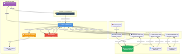

SRAG Health Monitor 🏥

Sistema de Monitoramento Inteligente de Surtos de SRAG (Síndrome Respiratória Aguda Grave) utilizando Inteligência Artificial Generativa para análise de dados e geração automatizada de relatórios epidemiológicos.

[](https://www.python.org/)
[](https://www.langchain.com/)
[](https://openai.com/)
[](LICENSE)

📋 Sobre o Projeto

Este projeto foi desenvolvido como parte da certificação de **Artificial Intelligence Engineer** pela Indicium HealthCare Inc. O objetivo é criar uma solução baseada em IA Generativa que auxilie profissionais da área da saúde a ter um entendimento em tempo real sobre a severidade e o avanço de surtos de doenças respiratórias.

Características Principais

- **Agente Orquestrador Inteligente**: Utiliza LangGraph e GPT-4.1-mini para coordenar análises complexas
- **Consulta Automatizada de Dados**: Acessa banco de dados com ~265 mil registros do DATASUS
- **Busca de Notícias em Tempo Real**: Contextualiza métricas com informações atualizadas
- **Geração de Visualizações**: Cria gráficos automaticamente para análise temporal
- **Relatórios Automatizados**: Compila análises completas em formato Markdown
- **Governança e Auditoria**: Sistema completo de logging e rastreabilidade
- **Guardrails de Segurança**: Validações em múltiplas camadas e proteção de dados (LGPD)

🏗️ Arquitetura



A solução é composta por 6 camadas principais:

1. **Camada de Apresentação**: Interface com usuários/profissionais de saúde
2. **Camada de Orquestração**: Agente principal, auditoria e guardrails
3. **Camada de Ferramentas**: Database Query, News Search e Chart Generation
4. **Camada de Dados**: SQLite, APIs de notícias e gráficos
5. **Camada de Processamento**: ETL de dados do DATASUS
6. **Camada de Saída**: Relatórios e logs de auditoria

Diagrama Conceitual

O diagrama conceitual completo está disponível em:
- **PNG**: [docs/architecture_diagram.png](docs/architecture_diagram.png)
- **PDF**: [docs/architecture_diagram.pdf](docs/architecture_diagram.pdf)
- **Mermaid**: [docs/architecture_diagram.mmd](docs/architecture_diagram.mmd)

📊 Métricas Geradas

O sistema calcula e analisa automaticamente:

1. **Taxa de Aumento de Casos**: Crescimento percentual nos últimos 30 dias
2. **Taxa de Mortalidade**: Percentual de óbitos em relação ao total de casos
3. **Taxa de Ocupação de UTI**: Percentual de casos que necessitaram UTI
4. **Taxa de Vacinação**: Percentual de pacientes com vacinação prévia

Além disso, gera:
- Gráfico de casos diários (últimos 30 dias)
- Gráfico de casos mensais (últimos 12 meses)

Instalação e Configuração

Pré-requisitos

- Python 3.11+
- pip3
- Variável de ambiente `OPENAI_API_KEY` configurada

Instalação

```bash
# Clone o repositório
git clone https://github.com/seu-usuario/srag-health-monitor.git
cd srag-health-monitor

# Instale as dependências
pip3 install -r requirements.txt

# Configure a variável de ambiente
export OPENAI_API_KEY="sua-chave-api"
```

Estrutura do Projeto

```
srag-health-monitor/
├── src/
│   ├── agents/
│   │   └── orchestrator.py          # Agente orquestrador principal
│   ├── tools/
│   │   ├── database_tool.py         # Ferramenta de consulta ao BD
│   │   ├── news_tool.py             # Ferramenta de busca de notícias
│   │   └── chart_tool.py            # Ferramenta de geração de gráficos
│   ├── database/
│   │   └── db_manager.py            # Gerenciador do banco SQLite
│   ├── utils/
│   │   └── data_processor.py        # Processador de dados DATASUS
│   └── guardrails/
│       ├── validators.py            # Validadores e guardrails
│       └── audit_logger.py          # Sistema de auditoria
├── data/
│   ├── raw/                         # Dados brutos do DATASUS
│   ├── processed/                   # Dados processados
│   └── srag.db                      # Banco de dados SQLite
├── outputs/
│   ├── reports/                     # Relatórios gerados
│   └── logs/                        # Logs de auditoria
├── docs/
│   ├── architecture_diagram.png     # Diagrama da arquitetura
│   ├── architecture_diagram.pdf     # Diagrama em PDF
│   └── datasus_info.md             # Informações sobre os dados
└── README.md
```

💻 Uso

1. Processar Dados do DATASUS

```bash
python3.11 src/utils/data_processor.py
```

2. Criar e Popular Banco de Dados

```bash
python3.11 src/database/db_manager.py
```

3. Gerar Relatório

```bash
python3.11 src/agents/orchestrator.py
```

O relatório será gerado em `outputs/reports/relatorio_YYYYMMDD_HHMMSS.md`

Exemplo de Uso Programático

```python
from src.agents.orchestrator import SRAGReportOrchestrator

# Criar orquestrador
orchestrator = SRAGReportOrchestrator()

# Gerar relatório
report = orchestrator.run()

print(report)
```

🔒 Governança e Transparência

Sistema de Auditoria

Todas as decisões do agente são registradas em logs estruturados (JSONL):

```json
{
  "event_id": "uuid",
  "timestamp": "2025-11-06T07:31:01",
  "event_type": "agent_decision",
  "execution_id": "20251106_073101",
  "data": {
    "decision": "Gerar relatório de SRAG",
    "reasoning": "Solicitação do usuário",
    "metadata": {}
  }
}
```

Guardrails Implementados

1. **Validação de Entrada**
   - Sanitização de parâmetros
   - Validação de tipos e ranges
   - Rate limiting

2. **Validação de Saída**
   - Verificação de métricas calculadas
   - Validação de estrutura de relatórios
   - Detecção de anomalias

3. **Proteção de Dados (LGPD)**
   - Detecção automática de PII (CPF, RG, telefone, email)
   - Anonimização de dados sensíveis
   - Dados já anonimizados na fonte (DATASUS)

📈 Resultados

Métricas Atuais (2024)

- **Total de Casos**: 265.087
- **Taxa de Mortalidade**: 7,67%
- **Taxa de Ocupação de UTI**: 27,89%
- **Taxa de Vacinação**: 52,90%
- **Tendência**: -3,67% (redução nos últimos 30 dias)

Exemplo de Relatório Gerado

Os relatórios incluem:
- Métricas principais com análise contextual
- Notícias recentes sobre SRAG
- Gráficos de visualização temporal
- Conclusões e recomendações baseadas em dados

🛠️ Tecnologias Utilizadas

- **Python 3.11**: Linguagem principal
- **LangChain/LangGraph**: Framework de agentes de IA
- **OpenAI GPT-4.1-mini**: Modelo de linguagem
- **SQLite**: Banco de dados
- **Pandas**: Processamento de dados
- **Matplotlib**: Visualizações
- **BeautifulSoup**: Web scraping (notícias)

📝 Critérios de Avaliação Atendidos

✅ Arquitetura
- Arquitetura modular e escalável
- Separação clara de responsabilidades
- Uso de design patterns (Factory, Strategy)

✅ Governança e Transparência
- Sistema completo de auditoria
- Logging estruturado em JSONL
- Rastreabilidade de todas as decisões
- Métricas de performance

✅ Guardrails
- Validação em múltiplas camadas
- Rate limiting
- Sanitização de inputs
- Validação de outputs

✅ Tratamento de Dados Sensíveis
- Conformidade com LGPD
- Detecção e anonimização de PII
- Dados já anonimizados na fonte
- Sem armazenamento de dados pessoais

✅ Clean Code
- PEP 8 compliance
- Type hints em todas as funções
- Docstrings completas
- Código modular e testável
- Logging apropriado

📚 Fonte de Dados

Os dados utilizados são provenientes do **OpenDATASUS**, especificamente do sistema **SIVEP-Gripe** (Sistema de Informação da Vigilância Epidemiológica da Gripe):

- **URL**: https://opendatasus.saude.gov.br/dataset/srag-2021-a-2024
- **Atualização**: Semanal
- **Cobertura**: Nacional (Brasil)
- **Granularidade**: Municipal, diária
- **Licença**: Creative Commons Atribuição

🔮 Melhorias Futuras

- [ ] Integração com APIs reais de notícias (Google News API, NewsAPI)
- [ ] Dashboard interativo com Streamlit/Dash
- [ ] Alertas automáticos por email/SMS
- [ ] Análise preditiva com Machine Learning
- [ ] Integração com outros sistemas de vigilância epidemiológica
- [ ] API REST para integração externa
- [ ] Suporte a múltiplas doenças respiratórias

👨‍💻 Autor

Desenvolvido como projeto de certificação em **Artificial Intelligence Engineer**.

📄 Licença

Este projeto está sob a licença MIT. Veja o arquivo [LICENSE](LICENSE) para mais detalhes.

**Nota**: Este é um projeto de demonstração para fins educacionais e de certificação. Para uso em produção, recomenda-se validação adicional por profissionais de saúde e epidemiologistas.
