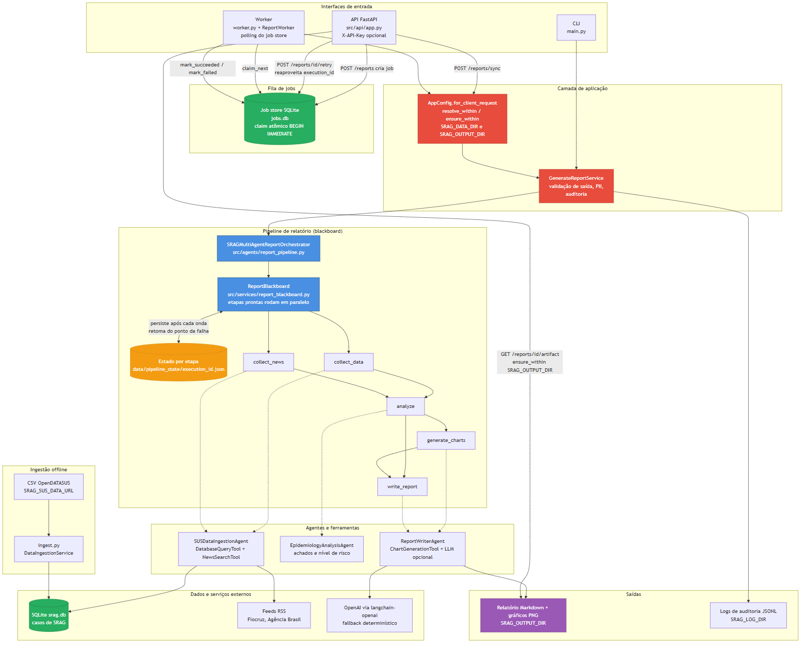
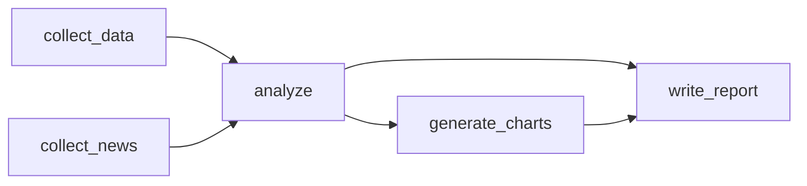

# Arquitetura da Solução - SRAG Health Monitor

## Visão Geral

Sistema de monitoramento de surtos de SRAG (Síndrome Respiratória Aguda Grave)
que consulta um cache SQLite de dados oficiais (DATASUS/SIVEP-Gripe), coleta
notícias de feeds RSS oficiais e gera um relatório epidemiológico em Markdown,
com gráficos e, opcionalmente, narrativa escrita por LLM.

A geração do relatório é coordenada por um **blackboard de etapas**: cada etapa
declara pré-requisitos sobre um estado compartilhado, etapas prontas rodam em
paralelo e o progresso é salvo em disco após cada onda, de modo que uma
execução que falhou pode ser retomada do ponto exato da falha. Não há framework
de grafo de agentes (o desenho antigo com LangGraph foi removido).

Diagrama completo: [`architecture_diagram.png`](architecture_diagram.png)
(fonte em [`architecture_diagram.mmd`](architecture_diagram.mmd), versão PDF em
[`architecture_diagram.pdf`](architecture_diagram.pdf)).

## Interfaces de Entrada

| Interface | Arquivo | Comportamento |
|-----------|---------|---------------|
| CLI | `main.py` | Chama `GenerateReportService` diretamente, com `AppConfig.from_env` (entrada confiável). |
| API HTTP | `src/api/app.py` (FastAPI) | `POST /reports` cria um job assíncrono; `POST /reports/sync` gera na hora; `POST /reports/{job_id}/retry` recria um job falho reaproveitando o `execution_id`; `GET /reports`, `GET /reports/{job_id}`, `GET /reports/{job_id}/artifact`, `GET /metrics`, `GET /health`, `GET /ready`. Autenticação por `X-API-Key` quando `SRAG_API_KEY` está definida. |
| Worker | `worker.py` + `src/services/report_worker.py` | Faz polling do job store, reserva um job por vez e executa o mesmo `GenerateReportService`. `--once` processa no máximo um job. |
| Ingestão | `ingest.py` + `src/services/data_ingestion_service.py` | Processo offline: baixa o CSV do OpenDATASUS (`SRAG_SUS_DATA_URL`), limpa com `SRAGDataProcessor` e carrega no SQLite. |

No `docker-compose.yml`, API e worker são serviços separados que compartilham os
volumes `data/` e `outputs/`.

## Fila de Jobs (`src/services/job_store.py`)

- `SQLiteJobStore` persiste jobs na tabela `report_jobs` de `jobs.db`
  (`SRAG_JOBS_DB_PATH`), com estados `queued`, `running`, `succeeded` e `failed`.
- **Claim atômico entre processos**: `claim_next` roda numa transação
  `BEGIN IMMEDIATE` (a trava de escrita é obtida antes do `SELECT`) e o
  `UPDATE` só vale se o job ainda estiver `queued`; se `rowcount != 1`, nada é
  devolvido. Assim, vários workers podem consumir o mesmo arquivo sem executar o
  mesmo job duas vezes.
- O worker grava o `execution_id` no job **antes** de executar, para que um job
  que falhe possa ser re-tentado via `/reports/{job_id}/retry` retomando o
  estado salvo do pipeline.
- `InMemoryJobStore` implementa o mesmo protocolo `JobStore` (usado em testes).

## Caminhos e Diretórios Base (`src/config.py`)

`AppConfig` centraliza caminhos e opções de runtime a partir de variáveis de
ambiente (`SRAG_DATA_DIR`, `SRAG_DB_PATH`, `SRAG_JOBS_DB_PATH`,
`SRAG_OUTPUT_DIR`, `SRAG_LOG_DIR`, `SRAG_MODEL`, `OPENAI_API_KEY`,
`SRAG_API_KEY`, `SRAG_NEWS_FEEDS`, ...).

Parâmetros vindos de clientes (API e payload de jobs) passam por
`AppConfig.for_client_request`, que nunca os interpreta como caminhos do
servidor:

- `check_relative_path`: validação sintática; rejeita caminhos absolutos,
  drive/UNC, segmentos `..` e byte nulo.
- `resolve_within(base, value)`: resolve o caminho (seguindo symlinks) e exige
  que fique dentro da base. `db_path` é relativo a `SRAG_DATA_DIR` e
  `output_dir` é subdiretório de `SRAG_OUTPUT_DIR`.
- `ensure_within(base, path)`: para caminhos já gravados pelo servidor (ex.:
  `report_path` de jobs antigos); o download de artefato só serve arquivos
  `.md` dentro de `SRAG_OUTPUT_DIR`.

A validação acontece na criação do job (API responde 400) e de novo no worker ao
executar.

## Caso de Uso (`src/services/report_service.py`)

`GenerateReportService.run(execution_id=None)` é o ponto único usado por CLI,
API síncrona e worker:

1. Instancia o orquestrador do pipeline (novo `execution_id` ou o recebido,
   para retomada).
2. Registra a decisão de início no audit log.
3. Executa o pipeline.
4. Valida o conteúdo do relatório (`OutputValidator.validate_report_content`).
5. Detecta e anonimiza PII (`DataPrivacyGuard`), regravando o arquivo se
   necessário.
6. Registra a geração (métricas, notícias, gráficos, duração) ou o erro no
   audit log e no `ExecutionTracker`.

## Pipeline de Relatório (Blackboard)

### Motor genérico: `src/services/report_blackboard.py`

- `Step(name, run, requires)`: uma etapa executa quando todas as etapas em
  `requires` estão `DONE`. `run` recebe uma cópia dos artefatos e devolve um
  dict com novos artefatos, mesclados no estado compartilhado.
- `ReportBlackboard.run()`: em loop, seleciona as etapas prontas e as executa em
  paralelo (`ThreadPoolExecutor`). Após cada onda, persiste status e artefatos
  em JSON. Se uma etapa falha, as irmãs concluídas na mesma onda são salvas
  antes de propagar `StepExecutionError`.
- Retomada: ao recriar o blackboard com o mesmo arquivo de estado, etapas `DONE`
  não são refeitas e etapas `FAILED` voltam a `PENDING`.
- Validações de construção: nomes duplicados e pré-requisitos desconhecidos são
  rejeitados; se sobrar etapa sem pré-requisito satisfazível, o pipeline falha
  como bloqueado.
- Contrato: artefatos trocados entre etapas precisam ser serializáveis em JSON.

### Etapas do relatório: `src/agents/report_pipeline.py`

`SRAGMultiAgentReportOrchestrator` monta as etapas e guarda o estado em
`<SRAG_DATA_DIR>/pipeline_state/<execution_id>.json`. O relatório final vai para
`<reports_dir>/relatorio_<execution_id>.md`; o arquivo de estado é removido ao
concluir com sucesso.

| Etapa | Pré-requisitos | Agente | Artefatos produzidos |
|-------|----------------|--------|----------------------|
| `collect_data` | - | `SUSDataIngestionAgent.collect_data` | `metrics`, `daily_cases`, `monthly_cases`, `source` |
| `collect_news` | - | `SUSDataIngestionAgent.collect_news` | `news` |
| `analyze` | `collect_data`, `collect_news` | `EpidemiologyAnalysisAgent.analyze` | `analysis` (achados e nível de risco) |
| `generate_charts` | `analyze` | `ReportWriterAgent.generate_charts` | `charts` |
| `write_report` | `analyze`, `generate_charts` | `ReportWriterAgent.write` | `report`, `narrative_mode` |

`collect_data` e `collect_news` rodam em paralelo na primeira onda. Ao retomar,
`upgrade_legacy_artifacts` migra estado salvo com chaves de métricas antigas
(`taxa_ocupacao_uti` para `proporcao_casos_uti`).

## Agentes e Ferramentas

### Agentes (`src/agents/`)

- **`SUSDataIngestionAgent`**: exige que o SQLite exista, coleta métricas e
  séries (30 dias e 12 meses) via `DatabaseQueryTool`, notícias via
  `NewsSearchTool` e metadados da fonte. Também expõe `refresh_cache`, que
  delega ao `DataIngestionService`.
- **`EpidemiologyAnalysisAgent`**: regras determinísticas que geram achados
  (crescimento, mortalidade, proporção de casos com internação em UTI,
  vacinação) e o nível de risco.
- **`ReportWriterAgent`**: gera os gráficos e escreve o Markdown. Com
  `OPENAI_API_KEY`, as seções "cenário atual" e "conclusões e recomendações"
  são escritas por `ChatOpenAI` (`langchain-openai`, saída estruturada
  `ReportNarrative`) a partir dos achados; sem chave, ou em caso de falha ou
  resposta vazia, usa texto determinístico (`narrative_mode`).

### Ferramentas (`src/tools/`)

As ferramentas são `BaseTool` do LangChain, chamadas diretamente pelos agentes
(não há seleção de ferramenta por LLM).

- **`DatabaseQueryTool`**: consultas `metrics`, `daily_cases` e
  `monthly_cases` no SQLite via `SRAGDatabase`, com validação de parâmetros por
  `InputValidator`.
- **`NewsSearchTool`**: lê feeds RSS configurados (`SRAG_NEWS_FEEDS`; padrão
  Agência Fiocruz e Agência Brasil - Saúde), ordena por relevância ao tema SRAG
  e por data; em falha de rede degrada para lista vazia, sem fabricar notícias.
- **`ChartGenerationTool`**: gráficos PNG (Matplotlib) de casos diários e
  mensais no diretório de relatórios.

## Banco de Dados (`src/database/db_manager.py`)

- **Tecnologia**: SQLite (`srag.db`, `SRAG_DB_PATH`), usado como cache curado
  dos dados do DATASUS.
- `SRAGDatabase` cria a tabela `casos_srag` e índices (data de notificação,
  UF, óbito, UTI), carrega o CSV processado e
  calcula as métricas: taxa de aumento de casos, taxa de mortalidade, proporção
  de casos com internação em UTI e taxa de vacinação, além das séries diária e
  mensal.
- O job store usa um arquivo SQLite separado (`jobs.db`).

## Pipeline de Dados (ingestão offline)

1. **Extração**: `DataIngestionService` baixa o CSV da URL configurada para
   `<SRAG_DATA_DIR>/raw`.
2. **Transformação**: `SRAGDataProcessor` (Pandas) limpa, trata ausentes,
   calcula idade e seleciona colunas.
3. **Carga**: o CSV processado é carregado no SQLite e os metadados da ingestão
   são gravados em `ingestion_metadata.json`.

## Governança, Auditoria e Guardrails

- **Audit log** (`src/guardrails/audit_logger.py`): eventos JSONL por dia em
  `SRAG_LOG_DIR` (decisões, validações, erros, geração de relatório), sempre
  associados ao `execution_id`.
- **`ExecutionTracker`**: sumário por execução (duração, validações, erros),
  devolvido pela API e registrado no job.
- **Validação de entrada**: `InputValidator` nas consultas ao banco; validação
  de caminhos de cliente em `config.py`.
- **Validação de saída**: `OutputValidator.validate_report_content` antes de
  entregar o relatório.
- **Dados sensíveis**: `DataPrivacyGuard` detecta e anonimiza PII no relatório;
  o prompt do LLM proíbe dados pessoais e números não presentes no contexto.
- **Acesso à API**: `X-API-Key` comparada em tempo constante quando
  `SRAG_API_KEY` está configurada.

## Tecnologias Utilizadas

- **Python 3.11**
- **FastAPI + Uvicorn**: API HTTP
- **SQLite**: dados de SRAG e fila de jobs
- **LangChain (`BaseTool`) + `langchain-openai`**: interface das ferramentas e
  chamada ao LLM (padrão `gpt-4.1-mini`, opcional)
- **Pandas / NumPy**: processamento de dados
- **Matplotlib**: gráficos
- **Requests / BeautifulSoup**: download de dados e leitura de feeds RSS
- **Pydantic**: validação de requisições e saída estruturada do LLM
- **Docker Compose**: serviços `api` e `worker`

## Critérios de Avaliação Atendidos

1. **Arquitetura**: modular; pipeline por blackboard com etapas declarativas,
   paralelas e retomáveis; API e worker desacoplados por fila persistente.
2. **Governança**: audit log JSONL e rastreabilidade por `execution_id`.
3. **Guardrails**: validação de entrada, de caminhos e de saída.
4. **Dados Sensíveis**: detecção e anonimização de PII.
5. **Clean Code**: type hints, ruff, mypy e testes automatizados no CI.
