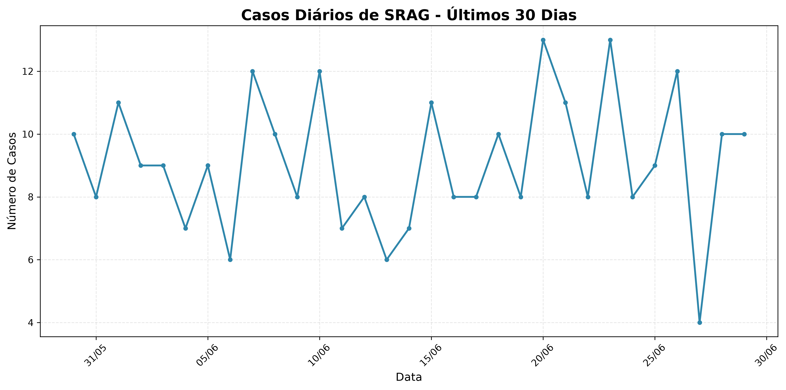
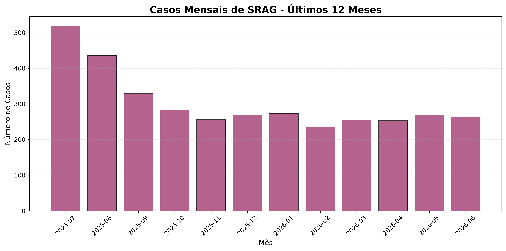

> **Nota:** exemplo gerado com dados sintéticos (18 meses, 5.189 casos, sazonalidade de inverno) para demonstrar o formato de saída do pipeline. Nenhum dado real do DATASUS foi utilizado.

# Relatório de Monitoramento de SRAG
## Síndrome Respiratória Aguda Grave - Brasil

**Data do Relatório:** 24/07/2026 13:24
**ID de Execução:** 20260724_132452_253666
**Nível de Risco:** BAIXO

---

## 1. Métricas Principais

### 1.1 Taxa de Aumento de Casos
**8.05%** nos últimos 30 dias em relação ao período anterior.

### 1.2 Taxa de Mortalidade
**7.61%** dos casos registrados resultaram em óbito.

### 1.3 Taxa de Ocupação de UTI
**15.67%** dos casos necessitaram de internação em UTI.

### 1.4 Taxa de Vacinação
**62.15%** dos pacientes registrados possuíam vacinação prévia.

---

## 2. Análise Contextual

### 2.1 Cenário Atual

Com base nos dados mais recentes do DATASUS, foram registrados **5,189** casos de SRAG.

Observa-se uma **tendência de crescimento** de 8.05% nos casos, indicando necessidade de atenção reforçada às medidas preventivas.

### 2.2 Achados Epidemiológicos

- **Moderate**: Casos relativamente estáveis no período recente.
- **Moderate**: Taxa de mortalidade observada: 7.61%.
- **Low**: Taxa de internação em UTI observada: 15.67%.
- **Moderate**: Taxa de vacinação observada: 62.15%.

### 2.3 Notícias Recentes

**1. InfoGripe: cai número de hospitalizações por VSR e por influenza A e B em grande parte do país**  
*Agência Fiocruz de Notícias - 2026-07-23*  
InfoGripe: cai número de hospitalizações por VSR e por influenza A e B em grande parte do país ricardo.valverde Qui, 23/07/2026 - 10:27

**2. InfoGripe: número de casos de VSR diminui, mas se mantém alto em muitos estados**  
*Agência Fiocruz de Notícias - 2026-07-16*  
InfoGripe: número de casos de VSR diminui, mas se mantém alto em muitos estados ricardo.valverde Qui, 16/07/2026 - 11:09

**3. Pesquisa mostra que vacinação diminuiu prevalência de HPV entre jovens**  
*Agência Brasil - Saúde - 2026-07-24*  
A prevalência dos principais tipos de HPV caiu quase à metade no Brasil após a vacinação, aponta o maior estudo sobre a eficácia do imunizante já realizado na América Latina. Dados coletados em 2016 e 2017 mostram que 14,98% dos participantes já tinham sido infectados por pelo menos um dos quatro tipos cobertos pela va…

**4. Fiocruz participa de encontro entre Brasil e Portugal para discutir acesso a medicamentos**  
*Agência Fiocruz de Notícias - 2026-07-21*  
Fiocruz participa de encontro entre Brasil e Portugal para discutir acesso a medicamentos ricardo.valverde Ter, 21/07/2026 - 16:56

**5. Com 13 casos de sarampo, São Paulo alerta para reforço na vacinação**  
*Agência Brasil - Saúde - 2026-07-21*  
O estado de São Paulo registrou 13 casos de sarampo em 2026, de acordo com a Secretaria de Estado da Saúde (SES-SP). Os diagnósticos foram em bebês de até 1 ano e em adultos entre 20 e 50 anos. Desde junho, a SES-SP recomenda a aplicação da dose zero da vacina tríplice viral (sarampo, rubéola e caxumba) para bebês de 6…

---

## 3. Visualizações

### 3.1 Casos Diários (Últimos 30 Dias)

### 3.2 Casos Mensais (Últimos 12 Meses)

---

## 4. Conclusões e Recomendações

- A taxa de mortalidade está **dentro da faixa esperada** para SRAG.
- A taxa de ocupação de UTI está **controlada**.
- A taxa de vacinação está **satisfatória**, contribuindo para o controle de casos graves.

---

## 5. Fonte e Rastreabilidade

- Fonte: DATASUS/SIVEP-Gripe
- Tipo de fonte: sqlite_cache
- Última atualização local: 2026-07-24T13:24:52.253667
- Narrativa: deterministica

---

**Relatório gerado automaticamente pelo Sistema de Monitoramento de SRAG**  
*Fonte de dados: DATASUS/SIVEP-Gripe*  
*Data de geração: 24/07/2026 às 13:24*
